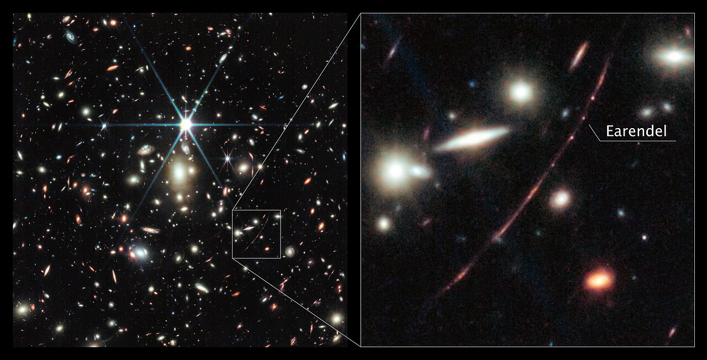

# YASS - Repository for Youth Astronomical Society of Seattle
[YASS Camp Flyer](content/YASS_Spring_Break_Camp_Flyer.png)

## Welcome to our YASS workshop!

Astronomy these days is all the rage!  We have the James Webb Space Telescope taking images from the very edge of our Universe 28 billion light years Away.  We have been able to see the very first stars that were formed soon after the big bang. [Earendel is just such a star cluster](https://en.wikipedia.org/wiki/WHL0137-LS)!
.

You may have some questions by now - how can a star cluster be 28 billion light years away when the Universe is "only" 13.8 billion years ols - good question! We will answer this and explore many other interesting facts about our solar system, galaxy and the Universe itself in this workshop. 

We will obtain pictures ourselves using our own telescope and wonder at how pretty they are!  However, we will not stop there, we will go much further to see how we can extract science out of what we observe. By going through the process of extracting science we will learn much about physics, mathematics and computing, are you ready??

First, however, we would like you to get familiar with Jupyter Notebook, a kind of all-in-one digital research tool used by over a 150 million researchers worldwide.  You are in great company!

You will need a username to access this notebook. That can be [seen here](usernames.md){:target="_blank"} if you have already confirmed your attendance. Passwords are what you make up on your own. You will have to remember it!  It is OK to write this password down in a proper paper notebook that you should have by your side throughout this workshop.  We will be asking you to note down many things there. The first one will be the password you will use to log in to the Jupyter Notebook! 

### [Go ahead - click here for your first login!]()

## Click below for Jupyter Notebooks
### [Table of Notebooks](notebooks)